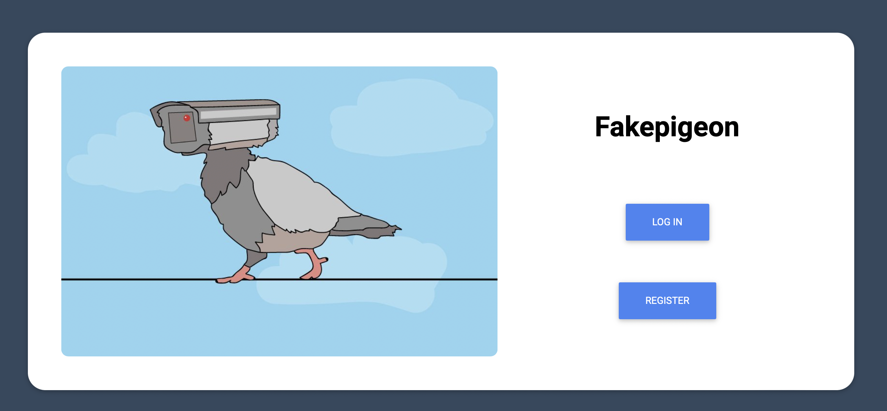

# PAT PROYECTO FINAL. FAKEPIGEON
- Gonzalo José Barceló Álvarez
- Alejandro Manuel López Gómez
- Maria Costa González
## DESCRIPCIÓN
Fakepigeon es una aplicación de chat online que permite al usuario mensajería tanto privada como la participación en un chat global de toda la aplicación. Ha sido realizada en Java empleando el framework de SpringBoot. Emplea elementos tales como Spring Security y el broker de mensajeria STOMP.

## WORK FLOW
La entrada a la aplicación se realiza a través de un portal (index.html) que ofrece al usuario la oportunidad de registrarse o logearse para entrar en su espacio personal. Una vez dentro se pasará a la página home.html, donde se permite al usuario seleccionar en qué chat desea participar, global o privado.

## INTERFAZ DE USUARIO Y NAVEGACIÓN

A continuación se explicará a través de imágenes el funcionamiento de la interfaz de la aplicación.

En primer lugar, para acceder al chat se necesitará autenticación previa que se lleva a efecto en la página index.html.

Como se aprecia en la imagen, se darán dos opciones: "Register" para introdir datos y crear un perfil como nuevo ususario y "Log in" para los usuarios ya registrados. Estas dos páginas se muestran en las imágenes a continuación.

*imagen de register.html*
*imagen de login.html*

Si ha iniciado sesión en la página login.html será redirigido a la página principal home.html; si ha necesitado registrarse, el usuario ha de previamente iniciar sesión para entrar en home.html.

*imagen de home.html*

La página home.html le dará la bienvenida y le ofrecerá dos opciones. "Join GlobalChat" le dará entrada a un chat común al que tienen acceso todos los usuario de la aplicación. Funciona como un chat de grupo en el que todos pueden participar con derechos de lectura y escritura.

*imagen de global.html*

Si se ha elegido la otra opción, "Join PrivateChat", accederá a la página private.html donde elegirá el usuario con el que quiere entablar conversación y comenzará un chat privado. A diferencia del GlobalChat, esta conversación ocurre entre dos usuarios solamente y ningún otro tiene acceso a ella.

*imagen de private.html*

Por último, indicar que se ha obtenido el dominio fakepigeons.net para un acceso más fácil a la aplicación.
